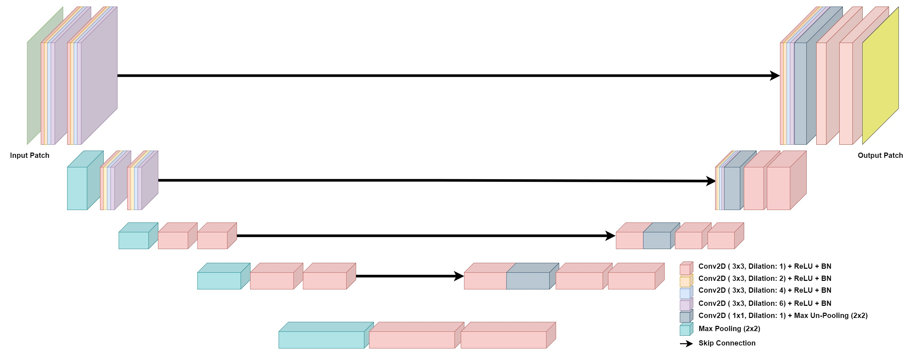
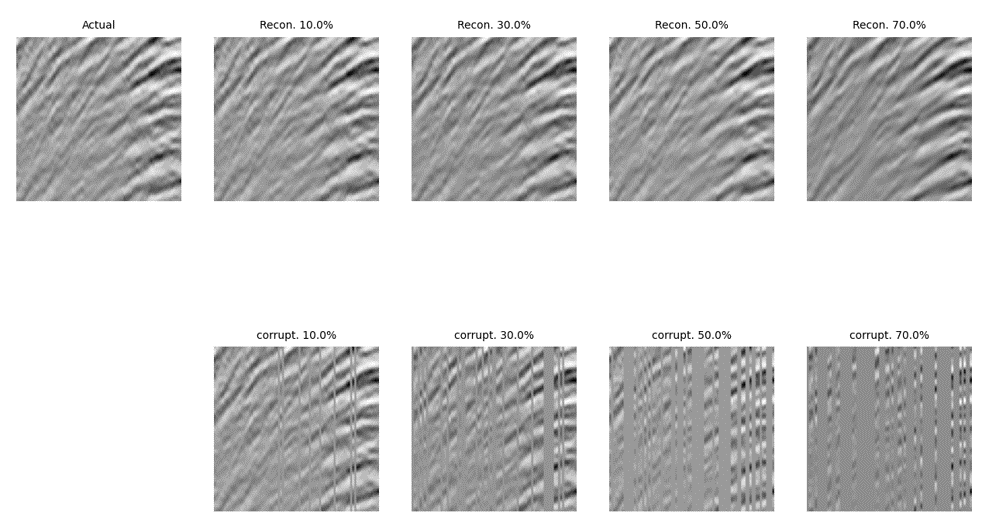

# U-Net-for-Seismic-Interpolation


This repo contains all codes developed while working on the term project for EE491 - Introduction to Machine Learning.

<p align="center">

</p>


## Installation\Set up


### Requirements
- python 3.7
- pip
- Anaconda (Preferable)


### 1- Clone the repo into your preferred directory:

```
git clone https://github.com/HashemShullar/U-Net-for-Seismic-Interpolation
```

### 2- Create a new virtual environment (We recommend using Conda):
 
```
conda create --name SeismicInterpolation python=3.7
```

### 3- Activate the environment:

```
conda activate  SeismicInterpolation
```

### 4- Run the [requirements.txt](https://github.com/HashemShullar/U-Net-for-Seismic-Interpolation) file to install the required packeges:

```
pip install -r requirements.txt
```


## Running the Code

You can download a pretrained model in adittion to the training and testing datasets from [OneDrive](https://kfupmedusa-my.sharepoint.com/:f:/g/personal/g201664780_kfupm_edu_sa/EjLKroxemL1BsGwI8Vx03bMBudWFWLd2gYZDx47VTGbs6Q?e=UPpWsH). After downloading the model you can either test it on a single patch or you can test the model on the testing dataset.

#### Make sure the patch you want to test is in the repository root directory (You can use the patch provided with the repo). Open a command prompt in the root directory and run [main.py](https://github.com/HashemShullar/U-Net-for-Seismic-Interpolation/blob/main/main.py) as follows:


 ```
python main.py --mode interpolate
```

#### You can also train your model from scratch.


 ```
python main.py --mode train
```


## Options table:


| Option | Purpose |
| ------ | ------ |
| patch_name | Specify patch name. Only .txt files can be used |
| lr | Learning rate used by the optimizer |
| batch_size | Numbe of images in each iteration |
| epochs | Number of training epochs |
| mode | 'train', 'test' or 'interpolate'. 'interpolate' is for testing on a single patch |
| corruption_precentage | % of traces to be removed from the image (For mode (interpolate)) |


## Results


<p align="center">

</p>


